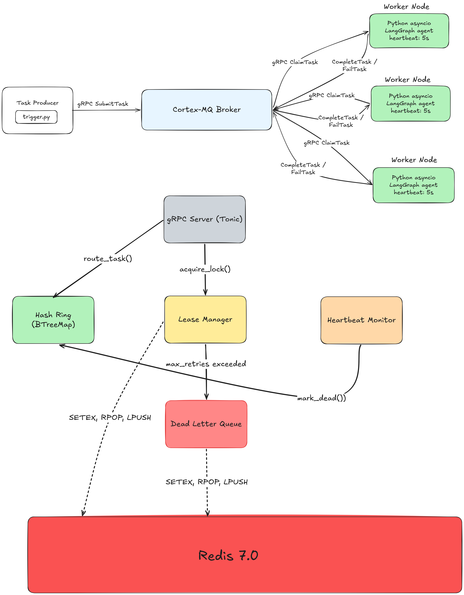

# Cortex-MQ

Distributed AI agent orchestration broker in Rust. Routes, leases, and
recovers tasks across a dynamic Python worker swarm — worker crashes
trigger automatic task reclamation, not silent data loss.

Built to solve the specific reliability gap in production LangGraph
deployments where node failures cause permanent task loss and require
manual intervention.

---

## The problem

When a worker node running LangGraph agents disconnects mid-task:

- The in-flight task disappears from the queue with no trace
- The orchestrator has no record of what payload was being processed
- Manual intervention is required to identify and re-inject the lost work
- In high-throughput deployments, this cascades into complete cluster stalls

Standard message queues solve this for stateless jobs. AI agents are
stateful — they hold tool call results, partial reasoning chains, and
LLM context that make naive requeue semantics incorrect.

Cortex-MQ solves this with lease-based task ownership: every claimed task
has a TTL-bound lease held in Redis. If a worker crashes, its lease expires
and the broker reclaims the task automatically — before the client notices.

---

## Architecture



Three components communicating exclusively over HTTP/2 gRPC:

| Component        | Stack                      | Responsibility                                              |
| ---------------- | -------------------------- | ----------------------------------------------------------- |
| `cortex-mq`      | Rust, Tokio, Tonic, Redis  | Broker: hash ring, lease management, heartbeat monitor, DLQ |
| `cortex-swarm`   | Python, asyncio, LangGraph | Workers: agent execution, autonomous reconnection           |
| `cortex-monitor` | Next.js, React             | Dashboard: cluster topology, CPU telemetry, task metrics    |

---

## Performance

Hardware: 12th Gen Intel(R) Core(TM) i5-1240P, Windows 11, Redis 7.0
Configuration: 150 virtual nodes per physical node, FNV-1a hashing
Benchmark tool: Criterion (100 samples per measurement)

| Metric                                 | Result                        |
| -------------------------------------- | ----------------------------- |
| Task routing P50 — 10-node ring        | 266 ns                        |
| Task routing P50 — 50-node ring        | 307 ns                        |
| Route 100 tasks around 1 dead node     | 5.64 μs                       |
| Node failure detection window          | 30s (3 missed × 10s interval) |
| Task reclamation after crash           | ~32s                          |
| Add node to 10-node ring               | 49.7 μs                       |
| Remove node from 10-node ring          | 17.99 μs                      |
| Hash ring O complexity on node removal | O(virtual_nodes)              |

```bash
cargo bench   # runs full benchmark suite
```

---

## Quick start

**Prerequisites:** Docker Desktop, OpenAI API key

```bash
# 1. Configure worker credentials
echo 'OPENAI_API_KEY=sk-your-key' > cortex-swarm/.env

# 2. Start the full cluster
docker compose up --build

# 3. Open the dashboard
open http://localhost:3000

# 4. Inject a task (separate terminal)
cd cortex-swarm && python trigger.py
```

Watch the worker terminal process the task through the LangGraph pipeline
and report completion back to the Rust broker.

---

## Technical decisions

### FNV-1a over xxHash or SipHash for ring routing

FNV-1a requires no initialization state, making it zero-cost to instantiate
per routing call. Its inner loop is branchless and cache-friendly for
fixed-length UUID inputs (36 bytes). The distribution uniformity requirement
for consistent hashing is significantly lower than for cryptographic use —
any hash where coefficient of variation across virtual nodes stays below 10%
is acceptable.

xxHash offers better throughput for large payloads but task routing keys are
always fixed-length UUIDs. SipHash adds keyed initialization that provides
DoS resistance we do not need in a trusted cluster. FNV-1a is 8 lines, zero
dependencies, and verifiably correct against the specification constants

### Four node states instead of binary healthy/dead

Most distributed systems model nodes as healthy or dead. AI infrastructure
fails more subtly.

Healthy → Suspect → Dead

↑ ↓

└── revived ← ------

(Draining: operator-initiated, separate path)

`Suspect` absorbs CPU spikes from LLM token generation without triggering
unnecessary task recovery. A node calling GPT-4 will saturate CPU for
hundreds of milliseconds. A binary model would mark it dead and cascade its
tasks to already-loaded neighbors. The soft limit (90% CPU → Suspect)
prevents this failure amplification without abandoning the node entirely.

`Draining` enables graceful operator-initiated shutdown: the node completes
its current leases and accepts no new assignments, allowing zero-downtime
deploys.

### Lease-based ownership over acknowledgment-based

Acknowledgment-based systems fail when the network partitions between the
ACK and the task state update — the task is delivered twice. Lease-based
ownership stores task ownership in Redis, not worker memory. If a worker
crashes mid-execution, its Redis lease expires and the broker reclaims —
the worker cannot hold a task hostage by dying before acknowledging.

Trade-off: leases require clock synchronization. We use Unix seconds with
a 5-second skew tolerance, adequate for single-datacenter deployments.
Multi-region would require logical clocks.

### BTreeMap for the ring over HashMap

Routing requires finding the nearest clockwise neighbor to a hash position.
This is a range query — `ring.range(hash..)` — that BTreeMap supports in
O(log n) and HashMap does not support at all. The ring is read far more than
it is written (every task submission reads, only node joins/leaves write),
so BTreeMap's O(log n) reads versus HashMap's O(1) are acceptable given the
correctness requirement.

### JSON serialization at the Redis boundary

Prost-generated Protobuf types implement binary wire format serialization
that conflicts with the Redis client's expectations. Storing prost types
directly in Redis produces data that cannot be deserialized on retrieval.
The fix: wrap task metadata in `serde_json::Value` at the Redis boundary.
This adds one serialization hop but eliminates the type conflict with no
practical overhead — Redis round-trip latency dwarfs JSON serialization cost
by three orders of magnitude.

### Rust broker, Python workers

The broker is the single throughput bottleneck. It must route without
becoming the constraint. Rust provides zero-cost abstractions, no GC pauses
during routing decisions, and Tokio's work-stealing scheduler for multi-core
utilization.

Workers use Python because LangGraph, LangChain, and OpenAI SDK are
Python-first. Rewriting agent execution in Rust would mean maintaining Rust
bindings to every LLM provider SDK — ongoing maintenance cost with no
performance benefit, since agent execution time is dominated by LLM API
latency (hundreds of milliseconds), not compute. The gRPC boundary is the
correct separation point.

---

## Project structure

cortex-mq/

├── src/

│ ├── main.rs # startup, config, server initialization

│ ├── api.rs # gRPC service implementation

│ ├── lib.rs # crate root, module declarations

│ └── core/

│ ├── broker.rs # server assembly, heartbeat monitor loop

│ ├── hash_ring.rs # consistent hash ring, node state machine

│ ├── state.rs # GlobalState: Redis operations, lock management

│ └── mod.rs

├── proto/

│ └── broker.proto # gRPC service and message definitions

├── benches/

│ └── throughput.rs # criterion benchmarks

├── examples/

│ ├── basic_producer.rs # minimal task submission

│ ├── worker_pool.rs # multi-worker simulation

│ └── failure_simulation.rs # node crash and recovery demo

├── cortex-swarm/

│ ├── worker.py # Python worker: claim loop, heartbeat, agent execution

│ ├── brain.py # LangGraph agent pipeline definition

│ └── trigger.py # task injection script

├── cortex-monitor/

│ └── src/

│ ├── app/page.tsx # dashboard metrics and layout

│ └── components/

│ └── ClusterVisualizer.tsx # real-time node topology

└── docker-compose.yml

---

## Configuration

| Variable                     | Default                  | Description                                     |
| ---------------------------- | ------------------------ | ----------------------------------------------- |
| `REDIS_URL`                  | `redis://127.0.0.1:6379` | Redis connection string                         |
| `GRPC_PORT`                  | `50051`                  | Broker gRPC listen port                         |
| `VIRTUAL_NODES`              | `150`                    | Virtual nodes per physical node in hash ring    |
| `HEARTBEAT_INTERVAL`         | `10`                     | Seconds between broker heartbeat checks         |
| `MISSED_HEARTBEAT_THRESHOLD` | `3`                      | Consecutive misses before node marked dead      |
| `MAX_MSG_MB`                 | `4`                      | Maximum gRPC message size in megabytes          |
| `LOG_FORMAT`                 | `pretty`                 | `pretty` for development, `json` for production |

---

## Development

```bash
# Run broker (requires Redis running locally)
cargo run

# Run tests
cargo test

# Run benchmarks
cargo bench

# Format and lint
cargo fmt && cargo clippy -- -W clippy::all
```

Worker:

```bash
cd cortex-swarm
pip install -r requirements.txt
python worker.py      # start a worker node
python trigger.py     # inject a task
```

---

## Roadmap

**V2 targets:**

- **Raft consensus for broker HA** — eliminate single coordinator as SPOF
- **Priority queues** — Redis sorted sets keyed by priority level
- **Skill-based routing** — tag workers with capabilities, route tasks to matching subsets
- **DLQ management API** — `ListDlqTasks`, `ReplayTask`, `DiscardDlqTask` (proto stubs exist)
- **Persistent audit log** — PostgreSQL event store for task lifecycle (schema in `migrations/`)
- **Distributed KV cache sharing** — shared KV cache across inference nodes eliminates
  redundant LLM prefix computation for identical system prompts
